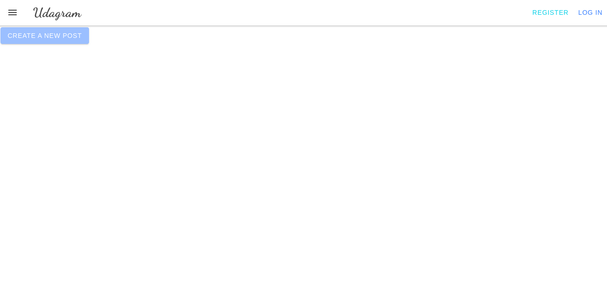
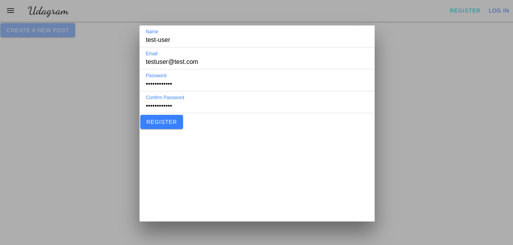
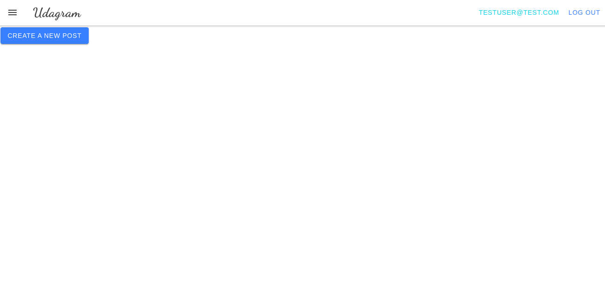

# Udagram

## Project overview
Udagram is a full-stack application built using Angular for the frontend, Express for the backend API, and PostgreSQL for the database. It is deployed on AWS Cloud, providing users the ability to create an account, log in, and post photos.

## Link to Frontend Application
Access the live application through this [link](http://udagram-432253917402.s3-website-us-east-1.amazonaws.com)

## Frontend views
Upon accessing the link provided, you will encounter the main view of the frontend application.

To create an account, click on the 'Register' button.

Once registered, you will be automatically logged into the application, and your provided email will be displayed in the navbar.

## Built With

- [Angular](https://angular.io/) - Single Page Application Framework
- [Node](https://nodejs.org) - Javascript Runtime
- [Express](https://expressjs.com/) - Javascript API Framework

## License

[License](LICENSE.txt)

