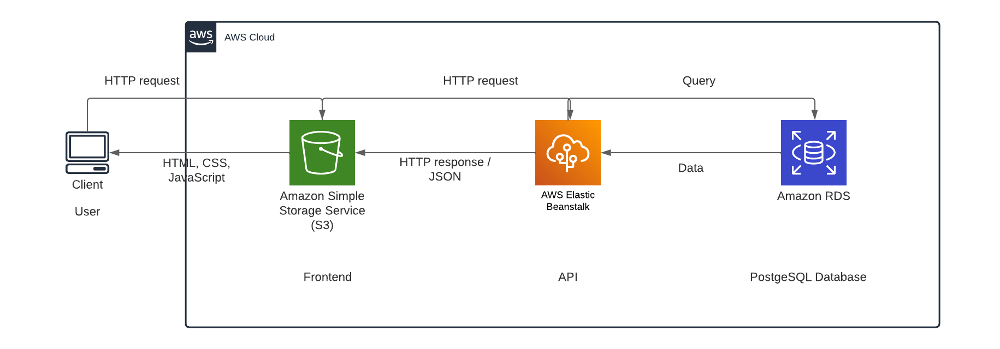

# Infrastructure Description for Udagram Application Deployment

## Overview

This document outlines the infrastructure requirements for Udagram consisting of a front-end built with Angular, and a back-end API developed using Express.js. The infrastructure leverages various AWS services to facilitate deployment, scalability, and management of the application.

## AWS Services Utilized

### Amazon Simple Storage Service (S3)

- **Purpose**: Hosts the compiled static files of the front-end application (HTML, CSS, JavaScript).

- **Why S3**: Provides a highly available and scalable hosting solution with built-in security features. The use of S3 also simplifies the deployment process and integrates well with other AWS services.

### AWS Elastic Beanstalk

- **Purpose**: Manages the deployment of the back-end API, including provisioning of server instances, auto-scaling, and health monitoring.

- **Why Elastic Beanstalk**: Offers an easy-to-use service for deploying and scaling web applications and services. It abstracts the infrastructure layer, allowing developers to focus on writing code rather than managing servers.

### Amazon Relational Database Service (RDS) - PostgreSQL

- **Purpose**: Hosts the PostgreSQL database that the back-end API interacts with to store and retrieve data.

- **Why Amazon RDS**: Simplifies the setup, operation, and scaling of a relational database. It provides cost-efficient and resizable capacity while automating time-consuming administration tasks such as hardware provisioning, database setup, patching, and backups.

## Architecture Flow

1. **Client Interaction**

    - Users interact with the client interface through a web browser.
    - The client makes HTTP requests to the AWS-hosted front-end or back-end services.

2. **Frontend**
    - Static files are served from Amazon S3 when the client makes an HTTP request to the front-end.
    - S3 responds with the necessary files, which are rendered by the user's browser.

3. **API**:
    - The client can make HTTP requests to the back-end API, which is hosted using AWS Elastic Beanstalk.
    - The API processes the request and interacts with the PostgreSQL database on Amazon RDS to query or store data.
    - After processing, the API responds with JSON data which the front-end application can use to update the user interface.

## Architecture Diagram

