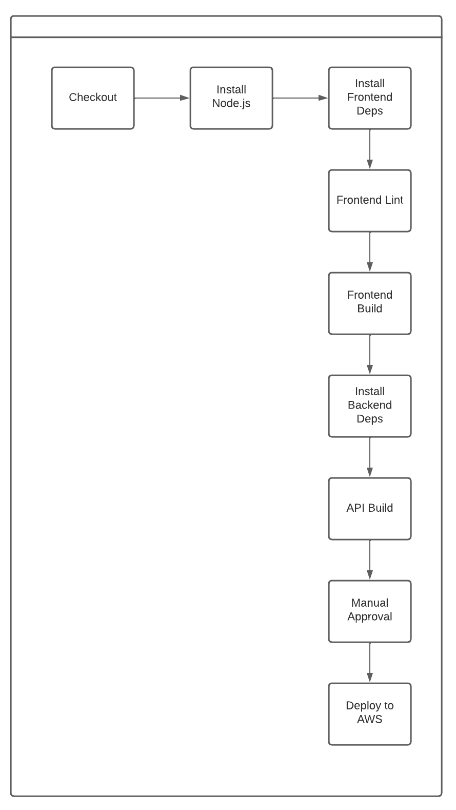

# Pipeline Description for Udagram Application Deployment

## General Structure of the Pipeline
The pipeline consists of two main jobs: build and deploy. These are executed in sequence within a workflow called udagram.

## 1. Build job

This job is the first in the CI/CD chain and includes the following steps:

- **Docker Environment**: Uses the cimg/node:14.15 Docker image, which is pre-configured with Node.js version 14.15.

- **Node.js Installation**: Using the node orb, Node.js is installed at the specified version.

- **Code Checkout**: Retrieves the latest code from the repository with the checkout step.

- **Frontend Dependency Installation**: Runs a custom script npm run frontend:install to install the necessary dependencies for the Angular application.

- **Backend Dependency Installation**: Similarly, a script npm run api:install should be executed to install the dependencies for the Express backend.

- **Frontend Linting**: A linting process using npm run frontend:lint should be run to check the code quality and conventions of the frontend.

- **Frontend Build**: The Angular application is built with npm run frontend:build.

- **Backend Build**: The Express backend application is built with npm run api:build.

## 2. Deploy job

This job takes care of deployment and is executed after manual approval in the workflow:

- **Docker Environment**: Uses the cimg/base:stable Docker image, which is a basic Docker image provided by CircleCI.

- **Environment Setup**: Installs Node.js, sets up AWS Elastic Beanstalk, and AWS CLI for handling operations on AWS.

- **Application Deployment**: Through a custom script npm run deploy, which would be responsible for deploying both the frontend and backend applications on AWS.

## Workflow

The udagram workflow manages the execution of the jobs in the following order:

1. **Build (build)**: Automatically executed on each push to the repository.
2. **Approval Hold (hold)**: This is a job that pauses the workflow so that a human can review the process before proceeding with the deployment. It's configured to act only when code is pushed to the master branch.
3. **Deployment (deploy)**: Once manually approved, it proceeds with the application deployment on AWS Elastic Beanstalk.

## Pipeline Diagram

